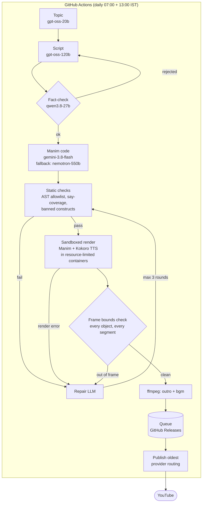

# shorts-pipeline

A fully autonomous, self-repairing pipeline that publishes one original animated
STEM explainer Short to YouTube every day — for **$0/month** in API and hosting
costs. Built for [TheComputeClub](https://www.youtube.com/@TheComputeClub).

Every day, with no human in the loop, the system:

1. **Picks a topic** it has never covered (LLM + topic history)
2. **Writes a ~75-second narration script** anchored to a real-world hook,
   then **fact-checks it with a different model family** — scripts get
   rejected and regenerated when the checker finds real errors
3. **Writes Manim animation code** for the script (LLM-generated, untrusted)
4. **Validates, renders, and repairs**: static AST checks, a sandboxed render,
   mechanical frame-bounds enforcement, and up to 3 LLM repair rounds fed with
   precise, machine-generated error reports
5. **Voices it** with local TTS and burns in word-timed captions
6. **Post-processes** with ffmpeg: channel outro + background music mixed
   under the narration
7. **Publishes** the oldest video from a buffered queue and refills the queue

## Architecture



Three containers, split for three different reasons:

| Service | Why it exists separately |
|---|---|
| `renderer` (Manim, Python 3.14) | Executes **untrusted LLM-generated code** — jailed with CPU/RAM limits, localhost-only, no host access |
| `tts` (Kokoro 82M, Python 3.12) | Kokoro doesn't run on 3.14 — containers solve the version conflict |
| `n8n` | Local experimentation only; production orchestration is GitHub Actions |

## The reliability engineering (the interesting part)

LLMs write broken code constantly. The pipeline assumes it and layers defenses:

- **Constrained API surface** — generated code targets a small scene template
  (`shorts_base.py`) with a narration-sync context manager, palette and layout
  constants, and a `sweep()` stage-clearing helper, taught via three
  hand-written example scenes.
- **Static checks before any render** — AST parse, import allowlist, banned
  constructs (`exec`, `open`, `os.`…), and narration-coverage verification.
  Catches failures in milliseconds instead of minutes of rendering.
- **Mechanical layout enforcement** — the template measures every mobject's
  bounding box at the end of every segment. Content out of frame = the render
  *fails* with an error like `segment 4: Axes right edge x=2.60 > 2.15`, which
  goes straight back to the repair LLM. A video can't ship looking broken.
- **Audio-visual sync from TTS word timestamps** — Kokoro returns per-word
  timings; captions are chunked and swapped by a frame-time updater, and every
  animation is budgeted against the narration segment's real duration.
- **Cross-family fact-checking** — a Qwen model reviews what a GPT-family
  model wrote; in testing it rejected an entire script over a subtle
  capacitor-physics error and caught a linearity overclaim a human would skim past.
- **Saturation fallbacks with retry/backoff** — every provider call survives
  429/5xx storms, truncation, dropped connections, and 200-with-error-payload
  responses; light steps fall back across models, and even the code model falls
  back to a second provider rather than losing a production day.
- **A buffered queue** — videos publish from a 5-deep queue (stored as GitHub
  Releases). A failed generation day costs queue depth, never a missed upload;
  an afternoon top-up run refills under fresh conditions.

## Models (all free tiers)

| Step | Model | Provider |
|---|---|---|
| Topic | gpt-oss-20b | Groq |
| Script | gpt-oss-120b | Groq |
| Fact-check | qwen3.8-27b | Groq |
| Code + repair | gemini-3.8-flash → nemotron-3-super (fallback) | Google → OpenRouter |
| Metadata | gemini-3.5-flash-lite | Google |
| Voice | Kokoro-82M | local CPU |

## Repo layout

```
.github/workflows/   daily.yml (publish + generate), topup.yml (refill)
renderer/            FastAPI render service: /render /validate /package /postprocess
tts/                 Kokoro TTS service: text -> WAV + word timestamps
prompts/             the six prompt templates ({{PLACEHOLDER}} style)
examples/            three hand-written example scenes the code LLM imitates
scripts/             production runners, publisher, verification utilities
pipeline_test.py     test harness: full pipeline + success-rate metrics
docs/HANDOVER.md     every decision, gotcha, and phase, in detail
```

## Running it yourself

```bash
cp .env.example .env         # add your own API keys
docker compose up -d --build
python3 pipeline_test.py --n 1          # one full end-to-end run
python3 scripts/generate_daily.py       # production: generate into the queue
python3 scripts/publish_daily.py --dry  # rehearse publishing
```

Secrets live only in `.env` (gitignored) and GitHub Actions Secrets.

---

*Built with [Claude Code](https://claude.com/claude-code) as the pair
programmer, documented end-to-end in `docs/HANDOVER.md`.*
